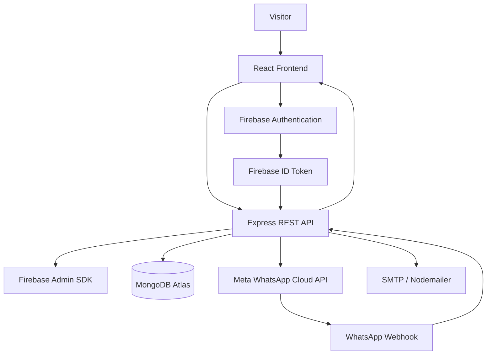

# Rhino Tours & Travels

<p align="center">
  
</p>

<p align="center">
  A production-ready multilingual travel platform for exploring and planning trips across Northeast India.
</p>

<p align="center">
  <a href="https://rhinotoursandtravels.com"><strong>Live Website</strong></a>
  ·
  <a href="https://api.rhinotoursandtravels.com/api/health"><strong>API Health</strong></a>
</p>

---

## Overview

**Rhino Tours & Travels** is a full-stack travel website built for a real-world tourism business operating across Northeast India.

The platform allows visitors to explore destinations, view suggested itineraries, submit trip enquiries, contact the business, authenticate using Firebase, and publish reviews.

The application goes beyond a standard frontend portfolio project by integrating a production backend, MongoDB persistence, Firebase Authentication, WhatsApp Cloud API notifications, SMTP email delivery, multilingual content, SEO infrastructure, security middleware, rate limiting, webhook verification, and production deployment on a custom domain.

### Live URLs

- **Website:** https://rhinotoursandtravels.com
- **API:** https://api.rhinotoursandtravels.com
- **API Health Check:** https://api.rhinotoursandtravels.com/api/health

---

## Key Features

### Travel Experience

- Responsive travel website for desktop, tablet, and mobile
- Destination discovery across Northeast India
- Dedicated destination detail pages
- Suggested travel itineraries
- Best-time-to-visit information
- Transportation guidance
- Destination highlights
- Trip enquiry form
- Contact form
- Customer reviews and ratings
- Travel statistics and business information
- Custom 404 page

### Featured Destinations

The website currently includes dedicated travel experiences for:

- Kaziranga
- Dawki
- Sela Pass
- Nongriat
- Tawang
- Cherrapunji

---

## Multilingual Support

The application supports three languages:

- English
- Hindi
- Assamese

Internationalization is implemented with:

- `i18next`
- `react-i18next`
- language persistence through `localStorage`
- automatic browser-language detection
- dynamic `<html lang="">` updates
- English fallback translations

The language system covers navigation, destinations, enquiries, authentication, reviews, legal pages, contact content, and other major UI areas.

---

## Authentication

Authentication is handled using **Firebase Authentication**.

Supported flows include:

- Email/password registration
- Email/password login
- Google authentication
- Logout
- Password reset
- Persistent authentication state
- Backend user synchronization

### Authentication Architecture

```text
User
  │
  ▼
Firebase Authentication
  │
  │ Firebase ID Token
  ▼
Express API
  │
  │ firebase-admin verifies token
  ▼
MongoDB User Record
```

Firebase is responsible for user credentials and identity.

MongoDB stores only application-level user information such as:

- Firebase UID
- Name
- Email
- Profile image
- Authentication provider
- Last login timestamp

**Passwords are never stored in MongoDB.**

---

## Reviews System

Authenticated users can submit reviews containing:

- Rating from 1–5
- Optional location
- Review comment

The backend verifies the user's Firebase ID token before accepting a review.

### Homepage Review Logic

The homepage:

- calculates the real average rating from all reviews
- calculates the total number of reviews
- displays only 5-star featured reviews
- randomly selects up to 6 featured reviews on each fetch

This keeps the displayed testimonials dynamic while preserving genuine aggregate review statistics.

### Review Protection

Authenticated review submissions are rate limited to:

```text
5 reviews / user / hour
```

The Firebase UID is used as the rate-limit identity.

---

## Travel Enquiry System

Visitors can send trip enquiries containing:

- Trip type
- Destination
- Start date
- End date
- Number of travellers
- Name
- Email
- Phone
- Additional message
- Optional WhatsApp consent

Supported trip types:

```text
Leisure
Adventure
Wildlife
Cultural
```

Supported destination regions:

```text
Assam
Meghalaya
Arunachal Pradesh
```

### Server-Side Validation

The API validates:

- Required fields
- Email format
- Travel dates
- Past start dates
- End date ordering
- Phone number format
- Traveller limits
- MongoDB schema constraints

Indian 10-digit phone numbers are normalized with country code `91` before storage and WhatsApp processing.

---

## WhatsApp Cloud API Integration

The enquiry workflow integrates with the **Meta WhatsApp Cloud API**.

When a new enquiry is created:

```text
Traveller submits enquiry
        │
        ▼
Express API validates request
        │
        ▼
Enquiry saved to MongoDB
        │
        ├──► Business receives WhatsApp notification
        │
        └──► Customer receives acknowledgement
             only when WhatsApp consent is provided
```

The system stores WhatsApp delivery information for both the customer and business notification.

Tracked states include:

```text
pending
sent
delivered
read
failed
skipped
```

The system also stores:

- WhatsApp message ID
- sent timestamp
- delivery status timestamp
- delivery errors

### Secure Webhook Verification

Incoming Meta webhook requests are authenticated using:

```text
X-Hub-Signature-256
```

The backend:

1. preserves the raw request body
2. calculates an HMAC SHA-256 signature using the Meta App Secret
3. compares signatures using `crypto.timingSafeEqual`
4. rejects invalid requests

This prevents unauthorized webhook payloads from modifying WhatsApp delivery states.

---

## Contact System

The Contact page connects directly to the backend.

Messages are delivered using **Nodemailer / SMTP**.

The backend performs validation for:

- Name
- Email
- Optional phone
- Subject
- Message
- Maximum field lengths

Contact submissions are protected with API rate limiting.

---

## Security

Production security was considered across both the frontend and backend.

### Implemented Security Measures

- Firebase ID token verification on protected API endpoints
- No application passwords stored in MongoDB
- Restricted CORS origin allowlist
- Helmet HTTP security headers
- Express rate limiting
- Server-side request validation
- Mongoose schema validation
- HMAC SHA-256 Meta webhook verification
- Constant-time webhook signature comparison
- Environment-variable based secrets
- `.env` files excluded from Git
- Firebase Admin credentials kept server-side
- WhatsApp credentials kept server-side
- SMTP credentials kept server-side
- MongoDB connection URI kept server-side
- External authentication handled by Firebase
- React's default output escaping used for user-generated review content

### API Rate Limits

| Endpoint | Limit |
|---|---:|
| Travel enquiries | 10 requests / 15 minutes |
| Contact form | 5 requests / 15 minutes |
| Authenticated reviews | 5 submissions / user / hour |

---

## SEO

The website contains a reusable SEO component that dynamically manages:

- Document title
- Meta description
- Robots directives
- Canonical URLs
- Open Graph title
- Open Graph description
- Open Graph URL
- Open Graph image
- Open Graph image alt text
- Open Graph site name

The production website also includes:

```text
robots.txt
sitemap.xml
canonical URLs
Open Graph image
favicon
SPA fallback routing
```

### Search Engine Infrastructure

The site has been configured for:

- Google Search Console
- Domain ownership verification
- XML sitemap submission
- Google URL inspection
- production canonical URLs

Authentication pages can be excluded from indexing where appropriate.

---

## Accessibility

Accessibility considerations include:

- Semantic page structure
- Accessible form labels
- Keyboard-accessible navigation
- Skip-to-main-content link
- `aria` attributes where required
- Decorative images hidden from assistive technology
- Descriptive image alternative text
- Language-aware HTML document
- Visible focus states
- Responsive layouts across screen sizes

---

## SPA Routing

The frontend uses `BrowserRouter`.

Production Apache routing includes an `.htaccess` fallback:

```apache
<IfModule mod_rewrite.c>
  RewriteEngine On
  RewriteBase /

  RewriteCond %{REQUEST_FILENAME} !-f
  RewriteCond %{REQUEST_FILENAME} !-d

  RewriteRule ^ index.html [L]
</IfModule>
```

This ensures direct requests such as:

```text
/about
/destinations
/destinations/kaziranga
/contact
```

return the React application instead of a server-side `404`.

---

## Tech Stack

### Frontend

| Technology | Purpose |
|---|---|
| React 19 | UI development |
| Vite 8 | Build tooling |
| Tailwind CSS 4 | Styling |
| React Router | Client-side routing |
| Firebase | Authentication |
| i18next | Internationalization |
| react-i18next | React translation integration |
| Lucide React | Icons |
| React Icons | Additional icons |
| React Hot Toast | User notifications |

### Backend

| Technology | Purpose |
|---|---|
| Node.js | JavaScript runtime |
| Express 5 | REST API |
| MongoDB | Application database |
| Mongoose | MongoDB ODM |
| Firebase Admin SDK | Server-side Firebase token verification |
| Nodemailer | SMTP email |
| Helmet | HTTP security headers |
| express-rate-limit | API abuse protection |
| Node Crypto | Webhook HMAC verification |

### External Services

| Service | Usage |
|---|---|
| Firebase Authentication | User identity |
| MongoDB Atlas | Production database |
| Meta WhatsApp Cloud API | Travel enquiry notifications |
| SMTP | Contact email delivery |
| Google Search Console | Search indexing |
| GoDaddy | Domain registration and DNS |
| Hostinger | Production hosting |

---

## Architecture



### Production Architecture

```text
rhinotoursandtravels.com
        │
        ├── Frontend
        │     React + Vite
        │     Hostinger
        │
        └── api.rhinotoursandtravels.com
              │
              └── Express API
                    │
                    ├── MongoDB Atlas
                    ├── Firebase Admin
                    ├── WhatsApp Cloud API
                    └── SMTP
```

---

## REST API

Base URL:

```text
https://api.rhinotoursandtravels.com
```

### Health

```http
GET /api/health
```

Response:

```json
{
  "success": true,
  "message": "Rhino Tours API is running"
}
```

### Users

```http
POST /api/users/sync
```

Requires:

```http
Authorization: Bearer <firebase-id-token>
```

Synchronizes the authenticated Firebase user with MongoDB.

### Reviews

```http
GET /api/reviews
```

Returns:

- featured reviews
- total review count
- average rating

---

```http
POST /api/reviews
```

Requires Firebase authentication.

Example request:

```json
{
  "rating": 5,
  "location": "Assam",
  "comment": "Wonderful travel experience."
}
```

### Enquiries

```http
POST /api/enquiries
```

Example request:

```json
{
  "tripType": "wildlife",
  "destination": "assam",
  "startDate": "2026-12-10",
  "endDate": "2026-12-15",
  "travellers": 2,
  "name": "Traveller Name",
  "email": "traveller@example.com",
  "phone": "9876543210",
  "message": "Interested in visiting Kaziranga.",
  "whatsappConsent": true
}
```

### Contact

```http
POST /api/contact
```

Example request:

```json
{
  "name": "Traveller Name",
  "email": "traveller@example.com",
  "phone": "+91 9876543210",
  "subject": "Trip enquiry",
  "message": "I would like more information about your packages."
}
```

### WhatsApp Webhook

```http
GET /api/webhooks/whatsapp
POST /api/webhooks/whatsapp
```

The `GET` endpoint handles Meta webhook verification.

The `POST` endpoint receives signed WhatsApp message-status updates.

---

## Project Structure

```text
Rhino-tour-and-Travels/
│
├── frontend/
│   ├── public/
│   │   ├── .htaccess
│   │   ├── favicon.png
│   │   ├── og-image.png
│   │   ├── robots.txt
│   │   └── sitemap.xml
│   │
│   ├── src/
│   │   ├── assets/
│   │   │
│   │   ├── components/
│   │   │   ├── DestinationCard.jsx
│   │   │   ├── EnquiryForm.jsx
│   │   │   ├── Footer.jsx
│   │   │   ├── HeroCarousel.jsx
│   │   │   ├── ItenerarySection.jsx
│   │   │   ├── LoadingSpinner.jsx
│   │   │   ├── Navbar.jsx
│   │   │   ├── PopularDestinations.jsx
│   │   │   ├── ReviewCard.jsx
│   │   │   ├── ReviewForm.jsx
│   │   │   ├── ReviewSection.jsx
│   │   │   ├── ReviewSummary.jsx
│   │   │   ├── SEO.jsx
│   │   │   └── TravelStats.jsx
│   │   │
│   │   ├── context/
│   │   │   └── AuthContext.jsx
│   │   │
│   │   ├── customHooks/
│   │   │   └── useAuth.js
│   │   │
│   │   ├── firebase/
│   │   │   └── firebase.js
│   │   │
│   │   ├── i18n/
│   │   │   ├── locales/
│   │   │   │   ├── as.json
│   │   │   │   ├── en.json
│   │   │   │   └── hi.json
│   │   │   └── i18n.js
│   │   │
│   │   ├── pages/
│   │   │   ├── About.jsx
│   │   │   ├── Contact.jsx
│   │   │   ├── DestinationDetails.jsx
│   │   │   ├── Destinations.jsx
│   │   │   ├── Home.jsx
│   │   │   ├── Login.jsx
│   │   │   ├── NotFound.jsx
│   │   │   ├── PrivacyPolicy.jsx
│   │   │   ├── Signup.jsx
│   │   │   └── TermsConditions.jsx
│   │   │
│   │   ├── App.jsx
│   │   └── main.jsx
│   │
│   ├── package.json
│   └── vite.config.js
│
├── backend/
│   ├── src/
│   │   ├── config/
│   │   │   ├── db.js
│   │   │   └── firebaseAdmin.js
│   │   │
│   │   ├── controllers/
│   │   │   ├── contactController.js
│   │   │   ├── enquiryController.js
│   │   │   ├── reviewController.js
│   │   │   └── userController.js
│   │   │
│   │   ├── middleware/
│   │   │   ├── verifyFirebaseToken.js
│   │   │   └── verifyWhatsAppSignature.js
│   │   │
│   │   ├── models/
│   │   │   ├── Enquiry.js
│   │   │   ├── Review.js
│   │   │   └── User.js
│   │   │
│   │   ├── routes/
│   │   │   ├── contactRoutes.js
│   │   │   ├── enquiryRoutes.js
│   │   │   ├── reviewRoutes.js
│   │   │   ├── userRoutes.js
│   │   │   └── whatsappWebhookRoutes.js
│   │   │
│   │   ├── services/
│   │   │   ├── emailService.js
│   │   │   └── whatsappService.js
│   │   │
│   │   └── app.js
│   │
│   ├── package.json
│   └── server.js
│
├── .gitignore
└── README.md
```

---

## Local Development

### Requirements

Install:

```text
Node.js 22+
npm
MongoDB Atlas account
Firebase project
```

For the complete production integration you will additionally need:

```text
Meta WhatsApp Cloud API credentials
SMTP credentials
```

Clone the repository:

```bash
git clone https://github.com/Envyiwnl/Rhino-tour-and-Travels.git
cd Rhino-tour-and-Travels
```

---

## Frontend Setup

```bash
cd frontend
npm install
```

Create:

```text
frontend/.env
```

Add:

```env
VITE_SITE_URL=http://localhost:5173
VITE_API_URL=http://localhost:5000

VITE_FIREBASE_API_KEY=
VITE_FIREBASE_AUTH_DOMAIN=
VITE_FIREBASE_PROJECT_ID=
VITE_FIREBASE_STORAGE_BUCKET=
VITE_FIREBASE_MESSAGING_SENDER_ID=
VITE_FIREBASE_APP_ID=
```

Start the development server:

```bash
npm run dev
```

The frontend will normally run at:

```text
http://localhost:5173
```

---

## Backend Setup

```bash
cd backend
npm install
```

Create:

```text
backend/.env
```

Configure the required environment variables.

### Core

```env
PORT=5000

MONGODB_URI=

CLIENT_URL=http://localhost:5173
```

### Firebase Admin

```env
FIREBASE_PROJECT_ID=
FIREBASE_CLIENT_EMAIL=
FIREBASE_PRIVATE_KEY=
```

### SMTP

```env
SMTP_HOST=
SMTP_PORT=
SMTP_SECURE=
SMTP_USER=
SMTP_PASS=

EMAIL_FROM_NAME=
CONTACT_RECEIVER_EMAIL=
```

### WhatsApp Cloud API

```env
WHATSAPP_ENABLED=

META_GRAPH_VERSION=
WHATSAPP_PHONE_NUMBER_ID=
WHATSAPP_ACCESS_TOKEN=
WHATSAPP_TEMPLATE_LANGUAGE=

WHATSAPP_CUSTOMER_TEMPLATE=
WHATSAPP_CLIENT_TEMPLATE=
WHATSAPP_CLIENT_NUMBER=

WHATSAPP_WEBHOOK_VERIFY_TOKEN=
META_APP_SECRET=

BUSINESS_PHONE=
BUSINESS_EMAIL=
```

Start the backend:

```bash
npm run dev
```

Production:

```bash
npm start
```

---

## Environment Variable Security

Never commit:

```text
.env
Firebase Admin private keys
MongoDB credentials
SMTP passwords
WhatsApp access tokens
Meta App Secret
Webhook verification tokens
```

The root `.gitignore` excludes environment files from version control.

Frontend variables beginning with:

```text
VITE_
```

are bundled into browser-side code by Vite and therefore must never contain server secrets.

---

## Production Deployment

The production system is deployed using:

### Frontend

```text
React + Vite
Hostinger
https://rhinotoursandtravels.com
```

Production build:

```bash
npm run build
```

Output:

```text
dist/
```

### Backend

```text
Node.js 22
Express
Hostinger
https://api.rhinotoursandtravels.com
```

Startup command:

```bash
npm start
```

### Database

```text
MongoDB Atlas
```

### DNS

DNS is managed through GoDaddy.

Production routing:

```text
rhinotoursandtravels.com
        → frontend

www.rhinotoursandtravels.com
        → frontend

api.rhinotoursandtravels.com
        → backend
```

---

## Production Lessons Demonstrated by This Project

This project includes several concerns that typically appear only after moving beyond local development:

- Configuring DNS for root and API subdomains
- Production SSL
- Separating frontend and backend origins
- Production CORS configuration
- React SPA fallback routing
- Firebase authorized domains
- Secure API token verification
- OAuth production configuration
- Persistent MongoDB user synchronization
- Third-party webhook authentication
- Rate limiting
- SMTP integration
- WhatsApp template messaging
- Tracking asynchronous message delivery states
- Environment-specific configuration
- SEO metadata
- XML sitemap configuration
- robots.txt
- Google Search Console verification
- Custom domain deployment

---

## Design Goals

The interface was designed around the visual identity of Northeast India tourism.

The UI combines:

- dark forest green
- warm orange accents
- cream and sage backgrounds
- large editorial serif typography
- rounded content cards
- nature-inspired imagery
- responsive layouts
- clear calls to action

The design prioritizes readability, destination imagery, enquiry conversion, and ease of navigation.

---

## Performance

The frontend uses:

- Vite production bundling
- route-level lazy loading for selected pages
- React Suspense loading UI
- reusable components
- production minification
- static asset fingerprinting

Further image conversion and optimization can reduce the initial transfer size of some destination and hero assets.

---

## Future Improvements

Potential future enhancements include:

- Image migration to WebP/AVIF
- Additional frontend code splitting
- Admin dashboard for enquiries and reviews
- Package / tour management
- Online booking workflow
- Payment integration
- CMS-backed destination content
- Additional destination coverage
- Structured data / JSON-LD
- Automated test coverage
- CI/CD workflow

---

## What This Project Demonstrates

This project demonstrates practical experience with:

- React component architecture
- Responsive UI development
- React Router
- React state and context
- Firebase Authentication
- OAuth
- REST API development
- Express middleware
- MongoDB data modelling
- Authentication middleware
- Third-party API integration
- Webhooks
- HMAC verification
- SMTP
- API security
- Rate limiting
- Internationalization
- SEO
- Accessibility
- DNS configuration
- Production deployment
- Full-stack debugging

---

## Author

**Parvez Mussarf Hussain**

Frontend / MERN Developer

GitHub: [@Envyiwnl](https://github.com/Envyiwnl)

---

## Project Status

**Production / Live**

The application is deployed and publicly accessible at:

### https://rhinotoursandtravels.com
